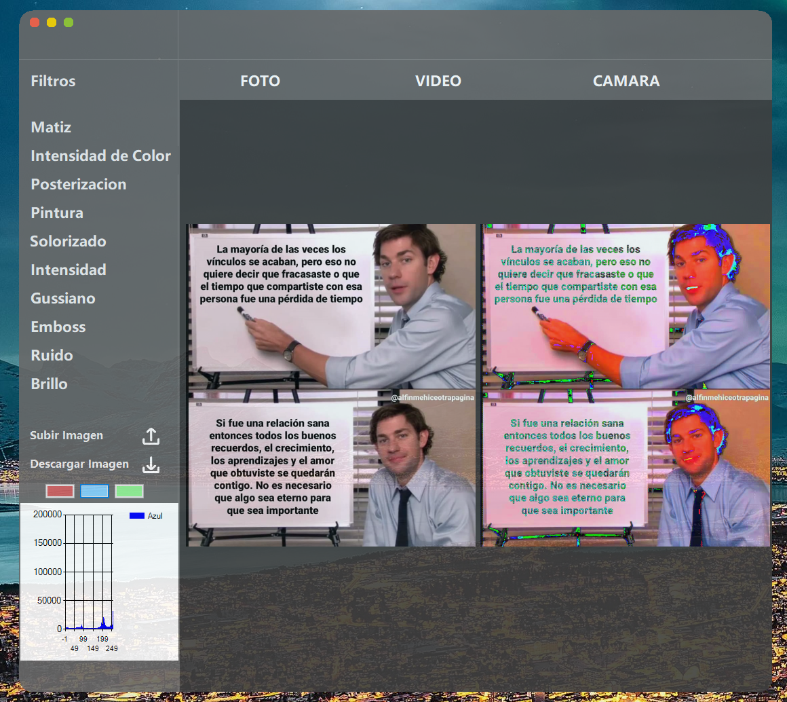
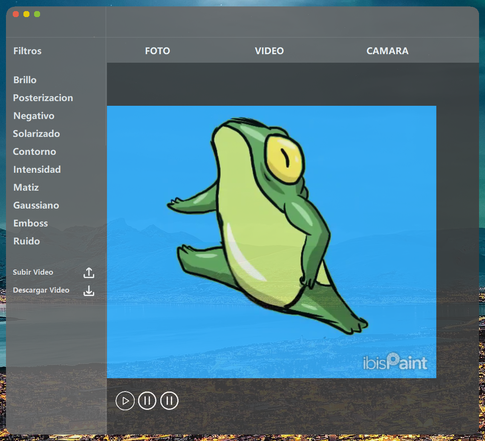
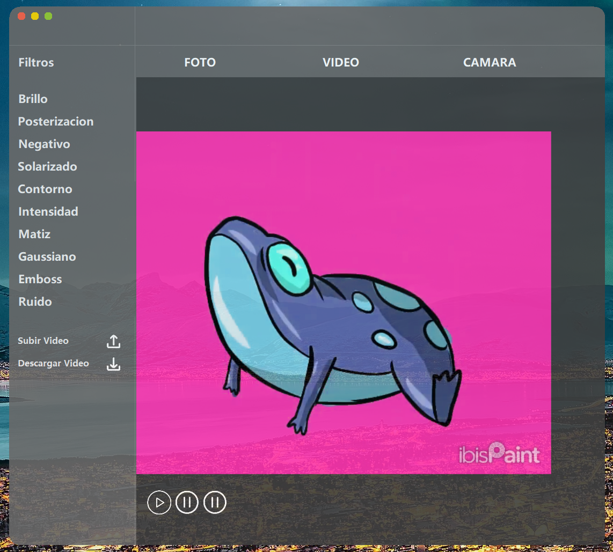
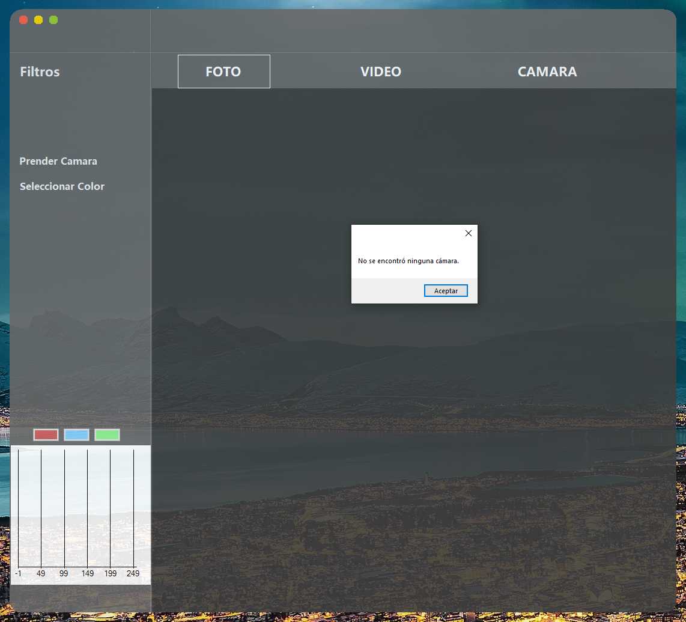

# 🎨 Filtros de Imagen, Video y Cámara en C#

Este proyecto es una aplicación desarrollada en C# (.NET) que permite aplicar filtros personalizados a imágenes, videos y cámara en tiempo real, así como descargar el resultado con los filtros aplicados.

---

## 📋 Descripción General

La aplicación cuenta con una interfaz dividida en tres pestañas principales:

### 🖼️ 1. Filtros para Imágenes

En esta sección puedes:

- Cargar una imagen desde tu dispositivo.
- Aplicar distintos filtros personalizados.
- Ver un histograma de colores actualizado según el filtro aplicado.
- Descargar la imagen con el filtro directamente a tu disco.

 

---

### 🎞️ 2. Filtros para Videos

En esta sección puedes:

- Adjuntar archivos de video desde tu PC.
- Reproducir, pausar o retroceder el video.
- Aplicar los mismos filtros que en la pestaña de imagen.
- Descargar el video con el filtro aplicado.

---

### 📷 3. Filtros con Cámara en Tiempo Real

En esta pestaña puedes:

- Activar tu cámara web (si está disponible).
- Detectar colores en tiempo real.
- Aplicar filtros en vivo.

> *Actualmente esta función está en desarrollo debido a falta de cámara para pruebas.*

 

---

## 🛠️ Tecnologías utilizadas

- C# (.NET Framework o .NET Core)
- WinForms / WPF (según el caso)
- `System.Drawing` para manipulación de imágenes
- `LockBits` para aplicar filtros personalizados de forma eficiente
- Otras bibliotecas de soporte (si las usas, como AForge, Accord, etc.)

---

